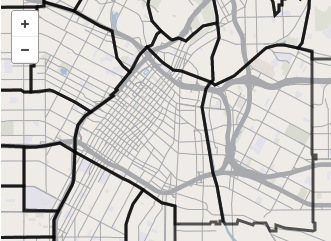

Print map maker
===============

A tool to generate print maps from Mapbox tiles

*Example image of Downtown Los Angeles with GeoJSON boundaries added.*

One of the main bottlenecks for print map production is the need to find and scan map images and trace a vector version. Print map maker will let you generate a map image with sufficient resolution to reproduce in print, based on your map styles. Simply enter an address or lat/lon coordinates and the map will center on your location. You can even add a GeoJSON layer to the map.

It will likely require setup time and learning some new skills. And while it's not perfect, the tool will cut production time dramatically on simple maps. 

* * *
### How it's done

Print map maker pulls in a global map generated from custom vector tiles created in [Mapbox Studio](https://www.mapbox.com/mapbox-studio/) using [OpenStreetMap](http://www.openstreetmap.org/) data and displays them using Mapbox's version of [leaflet.js](http://leafletjs.com/). 

[Geocodify](https://github.com/datadesk/jquery-geocodify) is used to autocomplete the address field and Mapbox's geocoder re-centers the map to the location. These can be adjusted or eliminated based on your needs. 

An image is generated using the [leaflet-image](https://github.com/mapbox/leaflet-image) plugin and appears at the bottom of your page. The user downloads the image and resizes it in the image editing program of their choice.   

### Getting started

Download the zip file and expand it on your computer. All of the files you need are in the folder. 

Download and install [Mapbox Studio](https://www.mapbox.com/mapbox-studio/). 

### Good things come in threes

If you plan to use this for print newspaper production, it helps to think of everything in multiples of three.

Assuming you have standard column sizes, you need to figure out the pixel width of your columns. If you use Adobe Illustrator, open your document and change the Units preferences to pixels. If your one-column graphic is 100 pixels wide, make your one-column div in the HTML page 300px (three times the width).

Here's where you change the sizes in the index.html page

    <style type="text/css" media="screen">

    #map_1col{width:330px; height:700px;}
    #map_2col{width:699px; height:1200px;}
    #map_3col{width:1065px; height:1200px;}
    #map_4col{width:1434px; height:1200px;}
    #map_web{width:1300px; height:731px;}

The tool generates a 72 ppi image, which translates to 72 dpi for print folk.  When the oversized image is downloaded it can be resized (without resampling) from a 72 ppi image to 216 ppi (3x). Save the resulting image and it should fit perfectly in your document. Then add labels and you're done.

### Customizing map tiles

Customizing map features works the same way. If your streets are 1 pt wide, make them 3 points wide in the CartoCSS and they will scale back down in the final image.  The example streets below end up .65 pt wide. You can also change appearance by zoom level.

    [class='street']{
      [zoom>=0] { line-width: 0; }
      [zoom>=12] { line-width: 0.6; }
      [zoom>=13] { line-width: 1; }
      [zoom>=14] { line-width: 1.95; }
      [zoom>=15] { line-width: 1.95; }
      [zoom>=16] { line-width: 1.95; }
    }

Custom map styles require a subscription to Mabox. A free subscription will get you one style. Five dollars per month will get you three and $49 per month will get you 10. That may seem like a lot but it's worth it considering for the production time saved. 

I have include a simplified set of styles to get you started. Open the Styles folder and then open mapbox-studio-style in a text editor. These are the map styles written in CartoCSS, which is similar to the styling used in HTML pages. 

In Mapbox Studio, create a new project based on OSM bright and take note of the style sheet on the left. Copy and paste the styles from the open document and replace the styles in Mapbox Studio. Save the project and you are ready to start customizing to match your styles. Experiment. You can always re-paste the original if something gets broken.

### The GeoJSON layer

To add boundary, line or point layers paste properly formatted GeoJSON into the field and click to ADD GeoJSON. It automatically applies styles for polygons, lines and points and adds them to all the maps. You can add multiple layers. If you are new to GeoJson learn more at [Wikipedia](http://en.wikipedia.org/wiki/GeoJSON), read the [specification](http://geojson.org/geojson-spec.html) or generate your own at [geojson.io](http://geojson.io/#map=2/20.0/0.0).

### Licensing
Mapbox and OpenStreetMap [license](http://www.openstreetmap.org/copyright) their data/tools. Print map maker strips the credit when the image is generated so a credit must be added below the map when publishing. 

 